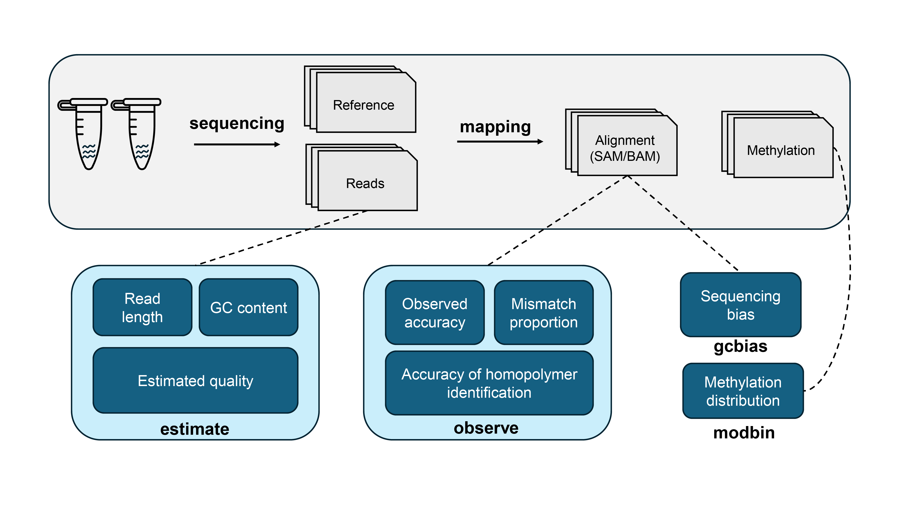

Overview
========
|image1|

**Giraffe** is specially designed to provide a comprehensive assessment
of the accuracy of long-read sequencing datasets obtained from both the
Pacific Biosciences (PacBio) and Oxford Nanopore Technologies (ONT)
platforms. We support functions that encompass read quality, sequencing
bias, and regional methylation proportion.

Author’s notes
==============

We are continuously improving **Giraffe** to enhance its usability and
expand its capabilities. Your feedback is greatly appreciated. You can
contact us via email at xudongliu98@gmail.com or
runsheng.li@cityu.edu.hk, or directly through the `GitHub issues
page <https://github.com/lrslab/Giraffe_View/issues>`__.

Workflow
========
|image2|

**Giraffe** offers four functions: ``estimate``, ``observe``,
``gcbias``, and ``modbin``. The ``estimate`` function provides users
with basic information, including estimated accuracy, Q value, length,
and GC content for each read. The ``observe`` function offers assessment
metrics such as observed accuracy, mismatch proportion, and homopolymer
identification. The ``gcbias`` function calculates the relationship
between average depth and GC content, reflecting the presence of
sequencing bias. The ``modbin`` function calculates the genomic regional
methylation proportion.

Installation
============

Dependencies
------------

**Giraffe** relies on several robustly maintained third-party Python
libraries, which are listed below.

-  pysam >= 0.17.0
-  numpy >= 1.7.0
-  pandas >= 1.5.0
-  seaborn >= 0.13.2
-  termcolor >= 2.0.0
-  biopython >= 1.6.2

When involving read processing tasks such as mapping and BAM sorting,
the following tools are required:
`samtools <https://www.htslib.org/>`__,
`minimap2 <https://github.com/lh3/minimap2>`__, and
`bedtools <https://github.com/arq5x/bedtools2>`__. The software versions
used during development are listed below.

-  samtools 1.17
-  minimap2 2.17-r941
-  bedtools 2.30.0

Option 1: Installation with conda
---------------------------------

.. code:: shell

   # install on the current environment
   conda install -c raymond_liu giraffe_view -y

   # install on a new environment
   conda create -n giraffe -c raymond_liu giraffe_view -y

Option 2: Installation with pip
-------------------------------

Install the dependencies for read processing first

.. code:: shell

   # install on the current environment
   conda install -c bioconda -c conda-forge samtools minimap2 bedtools -y

   # install on a new environment
   conda create -n giraffe -c bioconda -c conda-forge python==3.9 samtools==1.17 minimap2==2.17 bedtools==2.30.0 -y && conda activate giraffe

Install the package from Pypi by pip

.. code:: shell

   pip install Giraffe-View

Quick usage
===========

**Giraffe** can be run with a one-button command or by executing
individual functions.

One-button pattern
------------------

.. code:: shell

   # Run function of "estimate", "observe", and "gcbias" with FASTQ files
   giraffe --read <read table> --ref <reference> --cpu <number of processes or threads>

   # Run function of "estimate", "observe", and "gcbias" with unaligned SAM/BAM files
   giraffe --read <unaligned SAM/BAM table> --ref <reference> --cpu <number of processes or threads>

   # Example for input table (sample_ID data_type file_path)
   sample_A ONT /home/user/data/S1.fastq
   sample_B ONT /home/user/data/S2.fastq
   sample_C ONT /home/user/data/S3.fastq
   ...

Here the data_type can be ONT DNA reads (**ONT**), ONT directly
sequencing reads (**ONT_RNA**), and Pacbio DNA reads (**Pacbio**).

Estimate function
-----------------

.. code:: shell

   # For the FASTQ reads
   giraffe estimate --read <read table> 

   # For the unaligned SAM/BAM files
   giraffe estimate --unaligned <unaligned SAM/BAM table>

Observe function
----------------

.. code:: shell

   # For FASTQ reads
   giraffe observe --read <read table> --ref <reference>

   # For unaligned SAM/BAM files
   giraffe observe --unaligned <unaligned SAM/BAM table> --ref <reference>

   # For aligned SAM/BAM files
   giraffe observe --aligned <aligned SAM/BAM table>

**Note:** If you are going to use aligned SAM/BAM files as input, please
remove the secondary alignment (**–secondary=no**) and add the MD tag
(**–MD**) before mapping by adding these two highlighted parameters.

GCbias function
---------------

.. code:: shell

   giraffe gcbias --ref <reference> --aligned <aligned SAM/BAM table>

Modbin function
---------------

.. code:: shell

   giraffe modbin --methyl <methylation table> --region <target region>

   # Example for methylation file (Chrom Start End Value):
   contig_A 132 133 0.92
   contig_A 255 256 0.27
   contig_A 954 955 0.52
   ...

Example
=======

Here, we provide demo datasets for testing the **Giraffe**. The
following commands can help to download them and run the demo.

.. code:: shell

   giraffe_run_demo

The demo datasets include three E. coli datasets: a 4.2 MB reference, 79
MB R10.4.1 reads, and 121 MB R9.4.1 reads. For the methylation files,
two files from zebrafish blood (23 MB) and kidney (19 MB) are included.
This demo takes approximately 7 minutes and 20 seconds to run, with a
maximum memory usage of 391 MB, based on a workstation with Intel® Xeon®
Platinum 8160 processors. This run includes the one-command pattern as
well as testing of the four individual functions with 2 threads.

Detailed usage
==============

.. code:: shell

   giraffe -h

.. code:: shell

   usage: 
      giraffe [subcommands] [options]          
      giraffe --read <read table> --ref <reference> --cpu <number of processes or threads> 
      giraffe --read <unaligned SAM/BAM table> --ref <reference> --cpu <number of processes or threads>

   example for table (sample_ID data_type file_path):
     sample_A ONT /home/user/data/S1.fastq
     sample_B ONT /home/user/data/S2.fastq
     sample_C ONT /home/user/data/S3.fastq
     ...

   note:
      version: 0.2.0
      data_type: ONT, ONT_RNA, or Pacbio
      For more details, please refer to the documentation: https://giraffe-documentation.readthedocs.io/en/latest.

   optional arguments:
     -h, --help            show this help message and exit
     --read                table of FASTQ read files
     --unaligned           table of the unaligned SAM/BAM files
     --ref                 reference file
     --cpu                 number of processes or threads (recommend to set this equal to the number of chromosomes, default:10)
     --binsize             reference will be split into bins of the specified size (default:1000)

   subcommands:
       subcommand and function
       estimate            Estimated accuracy, length, and GC content.
       observe             Observed accuracy, mismatch proportion, and homopolymer identification.
       gcbias              Relationship between GC content and sequencing depth.
       modbin              Average modification proportion at regional level.

.. _one-button-pattern-1:

One-button pattern
------------------

The one-button pattern supports FASTQ reads or unaligned SAM/BAM files
as input, and conducts the analysis involving read quality
(``estimate``, ``observe``, and ``gcbias``). After the analysis is
finished, an `HTML <https://lxd98.github.io/giraffe.github.io/>`__
summary will generated with results statics and figures.

Input table
~~~~~~~~~~~

A table with sample ID, data type, and file path.

.. code:: shell

   # for FASTQ
   sample_A ONT /home/user/data/S1.fastq
   sample_B ONT /home/user/data/S2.fastq
   sample_C ONT /home/user/data/S3.fastq

   # for unaligned SAM/BAM
   sample_A ONT /home/user/data/S1.bam
   sample_B ONT /home/user/data/S2.bam
   sample_C ONT /home/user/data/S3.bam

Parameters
~~~~~~~~~~

``--read``

​ If the input files are FASTQ reads, use the ``--read`` to provide the
table to the software.

``--unaligned``

​ If the input files are unaligned SAM/BAM files, use the
``--unaligned`` to provide the table to the software.

``--ref``

​ Using ``--ref`` to provide the reference for read mapping.

``--cpu``

​ The number of threads or processes used for analysis, with a default
value of 10. It is recommended to set this equal to the number of
chromosomes.

``--binsize``

​ This parameter is used for the ``gcbias`` function. The reference will
be split into bins for calculating GC content and sequencing depth. The
default value is 1 kb.

Running demo
~~~~~~~~~~~~

.. code:: shell

   # for human FASTQ reads
   giraffe --read read.txt --ref chromosome.fa --cpu 24 --binszie 5000

   # for human unaligned SAM/BAM
   giraffe --unaligned unaligned.txt --ref chromosome.fa --cpu 24 --binszie 5000

.. _estimate-function-1:

Estimate function
-----------------

.. code:: shell

   giraffe estimate -h

.. code:: shell

   usage: 
     giraffe estimate --read <read table>              # For the FASTQ reads.
     giraffe estimate --unaligned <unaligned SAM/BAM table>    # For the unaligned SAM/BAM files.

   example for table (sample_ID data_type file_path):
     sample_A ONT /home/user/data/S1.fastq
     sample_B ONT /home/user/data/S2.fastq
     sample_C ONT /home/user/data/S3.fastq
     ...

   note:
      version: 0.2.0
      data_type: ONT, ONT_RNA, or Pacbio
      For more details, please refer to the documentation: https://giraffe-documentation.readthedocs.io/en/latest.

   optional arguments:
     -h, --help    show this help message and exit
     --read        table of FASTQ read files
     --unaligned   table of the unaligned SAM/BAM files
     --cpu         number of processes or threads (default:10)
     --plot        results visualization

.. _input-table-1:

Input table
~~~~~~~~~~~

``estimate`` supports the FSATQ and unaligned SAM/BAM files as input.

.. code:: shell

   # for FASTQ
   sample_A ONT /home/user/data/S1.fastq
   sample_B ONT /home/user/data/S2.fastq
   sample_C ONT /home/user/data/S3.fastq

   # for unaligned SAM/BAM
   sample_A ONT /home/user/data/S1.bam
   sample_B ONT /home/user/data/S2.bam
   sample_C ONT /home/user/data/S3.bam

.. _parameters-1:

Parameters
~~~~~~~~~~

``--unaligned``

​ If the input files are unaligned SAM/BAM files, use the
``--unaligned`` to provide the table to the software.

``--read``

​ If the input files are FASTQ reads, use the ``--read`` to provide the
table to the software.

``--cpu``

​ The number of threads or processes used for analysis, with a default
value of 10.

``--plot``

​ If specific to the ``--plot``, the **Giraffe** will visualize the
results including estimated read accuracy, reading length, and GC
content.

.. _running-demo-1:

Running demo
~~~~~~~~~~~~

.. code:: shell

   # for human FASTQ reads
   giraffe --read read.txt --cpu 24

   # for human unaligned SAM/BAM
   giraffe --unaligned unaligned.txt --cpu 24

.. _observe-function-1:

Observe function
----------------

.. code:: shell

   giraffe observe -h

.. code:: shell

   usage: 
       giraffe observe --aligned <aligned SAM/BAM table>               
       giraffe observe --read <read table> --ref <reference>           
       giraffe observe --unaligned <unaligned SAM/BAM table> --ref <reference> 

   example for table (sample_ID data_type file_path):
     sample_A ONT /home/user/data/S1.fastq
     sample_B ONT /home/user/data/S2.fastq
     sample_C ONT /home/user/data/S3.fastq

   note:
      version: 0.2.0
      data_type: ONT, ONT_RNA, or Pacbio
      For more details, please refer to the documentation: https://giraffe-documentation.readthedocs.io/en/latest.

   optional arguments:
     -h, --help    show this help message and exit
     --read        table of the FASTQ read files
     --aligned     table of the aligned SAM/BAM files
     --unaligned   table of the unaligned SAM/BAM files
     --ref         reference file
     --cpu         number of processes or threads (recommend to set this equal to the number of chromosomes, default:10)
     --plot        results visualization

.. _input-table-2:

Input table
~~~~~~~~~~~

``observe`` supports the FSATQ, unaligned SAM/BAM files, and aligned
SAM/BAM as input.

.. code:: shell

   # for FASTQ
   sample_A ONT /home/user/data/S1.fastq
   sample_B ONT /home/user/data/S2.fastq
   sample_C ONT /home/user/data/S3.fastq

   # for (un)aligned SAM/BAM
   sample_A ONT /home/user/data/S1.bam
   sample_B ONT /home/user/data/S2.bam
   sample_C ONT /home/user/data/S3.bam

.. _parameters-2:

Parameters
~~~~~~~~~~

``--read``

​ If the input files are FASTQ reads, use the ``--read`` to provide the
table to the software.

``--aligned``

​ If the input files are aligned SAM/BAM files, use the ``--aligned`` to
provide the table to the software.

``--unaligned``

​ If the input files are unaligned SAM/BAM files, use the
``--unaligned`` to provide the table to the software.

``--ref``

​ Provide the reference for read mapping.

``--cpu``

​ The number of threads or processes used for analysis, with a default
value of 10. It is recommended to set this equal to the number of
chromosomes.

``--plot``

​ If specific to the ``--plot``, the **Giraffe** will visualize the
results including observed read accuracy, mismatch proportion, and
homopolymer identification.

.. _running-demo-2:

Running demo
~~~~~~~~~~~~

.. code:: shell

   # for human FASTQ reads
   giraffe --read read.txt --ref chromosome.fa --cpu 24 --plot

   # for unaligned human SAM/BAM
   giraffe --unaligned unaligned.txt --ref chromosome.fa --cpu 24 --plot

   # for aligned human SAM/BAM
   giraffe --aligned aligned.txt --cpu 24 --plot

**Note:** If you are going to run the mapping independently, please
remove secondary alignments by using ``--secondary=no`` and add the MD
tag with ``--MD`` during mapping.

.. _gcbias-function-1:

GCbias function
---------------

.. code:: shell

   giraffe gcbias -h

.. code:: shell

   usage: 
      giraffe gcbias --ref <reference> --aligned <aligned SAM/BAM table> --binsize 5000 --cpu 24

   example for table (sample_ID data_type file_path):
      sample_A ONT /home/user/data/S1.sort.bam
      sample_B ONT /home/user/data/S2.sort.bam
      sample_C ONT /home/user/data/S3.sort.bam
      ...

   note:
      version: 0.2.0
      data_type: ONT, ONT_RNA, or Pacbio
      For more deatails, please refer to the documentation: https://giraffe-documentation.readthedocs.io/en/latest.

   optional arguments:
     -h, --help  show this help message and exit
     --ref       reference file
     --aligned   table of sorted SAM/BAM files
     --binsize   reference will be split into bins of the specified size (default:1000)
     --plot      results visualization
     --cpu       number of processes or threads (recommend to set this equal to the number of chromosomes, default:10)

.. _input-table-3:

Input table
~~~~~~~~~~~

``gcbias`` supports the aligned SAM/BAM as input.

.. code:: shell

   # for aligned SAM/BAM
   sample_A ONT /home/user/data/S1.bam
   sample_B ONT /home/user/data/S2.bam
   sample_C ONT /home/user/data/S3.bam

.. _parameters-3:

Parameters
~~~~~~~~~~

``--aligned``

​ If the input files are aligned SAM/BAM files, use the ``--unaligned``
to provide the table to the software.

``porportion--ref``

​ Using ``--ref`` to provide the reference for read mapping.

``--cpu``

​ The number of threads or processes used for analysis, with a default
value of 10. It is recommended to set this equal to the number of
chromosomes.

``--binsize``

​ The reference will be split into bins for calculating GC content and
sequencing depth. The default value is 1 kb.

``--plot``

​ If specific to the ``--plot``, the **Giraffe** will visualize the
results including the distribution of bin among the GC content and the
relationship between normalized depth and GC content.

.. _running-demo-3:

Running demo
~~~~~~~~~~~~

.. code:: shell

   giraffe gcbias --ref chromosome.fa --aligned aligned.txt --binsize 5000 --cpu 24 --plot

.. _modbin-function-1:

Modbin function
---------------

.. code:: shell

   giraffe modbin -h

.. code:: shell

   usage: 
      giraffe modbin --methyl <methylation table> --region <target region> 

   example for table (sample_ID data_type file_path):
      sample_A ONT /home/user/data/S1_5mC.txt
      sample_B ONT /home/user/data/S2_5mC.txt
      sample_C ONT /home/user/data/S3_5mC.txt
      ...

   example for methylation file (Chrom Start End Value):
      contig_A 132 133 0.92
      contig_A 255 256 0.27
      contig_A 954 955 0.52
      ...

   note:
      version: 0.2.0
      data_type: ONT, ONT_RNA, or Pacbio
      For more deatails, please refer to the documentation: https://giraffe-documentation.readthedocs.io/en/latest.

   optional arguments:
     -h, --help  show this help message and exit
     --methyl    table of methylation files
     --region    target region file (Chromosome Start End Region_name)
     --cpu       number of processes or threads (recommend to set this equal to the number of chromosomes, default:10)
     --plot      results visualization

.. _input-table-4:

Input table
~~~~~~~~~~~

``gcbias`` supports the processed methylation files.

::

   # the input methylation table
   sample_A ONT /home/user/data/S1_5mC
   sample_B ONT /home/user/data/S2_5mC
   sample_C ONT /home/user/data/S3_5mC

   # example for methylation file (chromosome start end value)
   contig_A 132 133 0.92
   contig_A 255 256 0.27
   contig_A 954 955 0.52

   # example for region (chromosome start end ID)
   chr1    6822    11822   ENSDARG00000102407
   chr1    13716   18716   ENSDARG00000102097
   chr1    20585   25585   ENSDARG00000099319
   chr1    22690   27690   ENSDARG00000099640
   chr1    31552   36552   ENSDARG00000104071

.. _parameters-4:

Parameters
~~~~~~~~~~

``--methyl``

​ Use the ``--methyl`` to provide the methylation file table to the
software.

``--region``

​ Use the ``--region`` to provide the target region table to the
software.

``--cpu``

​ The number of threads or processes used for analysis, with a default
value of 10.

``--plot``

​ If specific to the ``--plot``, the **Giraffe** will visualize the
results including the distribution of methylation at the regional level.

.. _running-demo-4:

Running demo
~~~~~~~~~~~~

.. code:: shell

   giraffe modbin --methyl methylation.txt --region region.txt --cpu 20 --plot 

Results
=======

When you run the command ``giraffe_run_demo``, you can get the following
outputs.

.. code:: shell

   Giraffe_Results
   ├── 1_Estimated_quality
   │   ├── 1_Read_estimate_accuracy.svg
   │   ├── 2_Read_GC_content.svg
   │   ├── 3_Read_length.svg
   │   └── Estimated_information.txt
   ├── 2_Observed_quality
   │   ├── 1_Observed_read_accuracy.svg
   │   ├── 2_Observed_mismatch_proportion.svg
   │   ├── 3_Homoploymer_summary.svg
   │   ├── Homoploymer_summary.txt
   │   ├── Observed_information.txt
   │   ├── R1041.bam
   │   ├── R1041.bam.bai
   │   ├── R1041.homopolymer_in_reference.txt
   │   ├── R941.bam
   │   ├── R941.bam.bai
   │   └── R941.homopolymer_in_reference.txt
   ├── 3_GC_bias
   │   ├── 1_Bin_distribution.svg
   │   ├── 2_Relationship_normalization.svg
   │   ├── Bin_distribution.txt
   │   ├── R1041_relationship_raw.txt
   │   ├── R941_relationship_raw.txt
   │   └── Relationship_normalization.txt
   ├── 4_Regional_modification
   │   ├── 1_Regional_modification.svg
   │   └── Regional_methylation_proportion.txt
   ├── giraffe_report.html
   └── Summary_html
       ├── 1_Bin_distribution.png
       ├── 1_Observed_read_accuracy.png
       ├── 1_Read_estimate_accuracy.png
       ├── 2_Observed_mismatch_proportion.png
       ├── 2_Read_GC_content.png
       ├── 2_Relationship_normalization.png
       ├── 3_Homoploymer_summary.png
       └── 3_Read_length.png

Summary file
------------

The ``giraffe_report.html`` provides a summary of results, including
statistics and figures. The ``Summary_html`` directory contains the
figures in PNG format for inclusion in the HTML report. The summary
website for the demo data is available
`here <https://lxd98.github.io/giraffe.github.io/>`__.

Estimate output
---------------

The directory of ``1_Estimated_quality`` includes the results of the
``estimate`` function. The ``*svg`` files are the visualization for read
accuracy, GC content, and length. The ``Estimated_information.txt`` is
the table that includes the details for each read.

::

   ReadID  Accuracy    Error   Q_value Length  GC_content  Group
   @9154e0a0-bb1d-413e-9d6f-f12e92c29293   0.9348  0.0652  11.8569 316 0.5032  R1041
   @fa8f2a80-ca1c-43af-9bfb-de68d020107a   0.9484  0.0516  12.8775 9621    0.4978  R1041
   @974e00c4-e0b4-44fe-a5c0-af28cb076b82   0.9730  0.0270  15.6819 424 0.3844  R1041
   @feffdc35-5e56-5643-b54b-42ae1ff0de69   0.9534  0.0466  13.3167 16320   0.4733  R1041
   @35e3622a-552c-454f-b08d-89624647ad58   0.9354  0.0646  11.8976 306 0.5458  R1041
   @570fd348-a78b-59cf-917c-bbc11fc6331d   0.9369  0.0631  12.0023 2040    0.5824  R1041

Observe output
--------------

The directory of ``2_Observed_quality`` includes the results of the
``estimate`` function. The ``*svg`` files are the visualization for read
accuracy, mismatch proportion, and homopolymer identification. The
``*bam`` and ``*bam.bai`` files are the alignment results and their
index for each group.

The ``*homopolymer_in_reference.txt`` files are the detailed information
of homopolymer in reference including the position, number of correct,
depth, type, and group. Only the homopolymer with a length over 3 bp
will be saved.

::

   pos num_of_mat  depth   type    Group
   ecoli_chrom_2320_2325   1   1   6T  R1041
   ecoli_chrom_2346_2349   2   2   4T  R1041
   ecoli_chrom_2364_2367   2   2   4T  R1041
   ecoli_chrom_2370_2373   2   2   4T  R1041
   ecoli_chrom_2408_2413   1   2   6A  R1041

The ``Homoploymer_summary.txt`` is the summary of homopolymer accuracy.

::

   Base    Accuracy    Group
   A   0.9063  R1041
   T   0.9072  R1041
   C   0.8572  R1041
   G   0.8554  R1041
   A   0.8416  R941
   T   0.8435  R941
   C   0.7611  R941
   G   0.7614  R941

The ``Observed_information.txt`` includes the detailed information for
each read.

::

   ID  Ins Del Sub Mat Iden    Acc Group
   70fbffe6-9df9-4163-9616-62bc6a403b49    3   1   1   354 0.9972  0.9861  R1041
   96a5c10b-bad2-46c8-a94a-75b84acb9aaf    3   11  2   342 0.9942  0.9553  R1041
   ff876292-515a-4284-930d-0215587fe1bb    1   9   21  386 0.9484  0.9257  R1041
   8d9c9e3e-c7b8-45fd-9d6d-d39a2d32299c    0   0   0   333 1.0000  1.0000  R1041
   19e2a295-8530-45c3-9d73-4454a7f814bf    2   8   3   288 0.9897  0.9568  R1041
   169815a2-80d8-4ea7-b617-6665a0b537a1    0   1   0   297 1.0000  0.9966  R1041

GCbias output
-------------

The directory of ``3_GC_bias`` includes the results of the ``gcbias``
function. The ``*svg`` files are the visualization for the distribution
of bin number across the GC content and the normalized depth across the
GC content.

The ``Bin_distribution.txt`` file includes the number of bin across the
GC content.

::

   GC_content      Number
   32      15
   33      10
   34      16
   35      16
   36      17

The ``*_relationship_raw.txt`` files include the average sequencing
depth, number of bin across the GC content.

::

   GC_content  Depth   Number  Group
   26  0.0 0   R1041
   27  9.166   1   R1041
   28  10.284  1   R1041
   29  10.731  3   R1041
   30  9.572125    8   R1041

The ``Relationship_normalization.txt`` file includes the normalized the
bins’ sequencing depth across the GC content.

::

   GC_content  Depth   Number  Group   Normalized_depth
   41  7.654527272727274   55  R1041   1.1639890313839232
   42  7.6615932203389825  59  R1041   1.1650635177922042
   43  7.444470588235295   102 R1041   1.1320466699544078
   44  7.162327586206898   116 R1041   1.0891424711787496
   45  7.023398230088496   113 R1041   1.0680161179896739
   46  7.691662162162162   148 R1041   1.1696359645574284
   47  7.295427777777778   180 R1041   1.1093824099161296
   48  7.004484732824428   262 R1041   1.0651400287713464
   49  7.1677831715210365  309 R1041   1.089972077141232

Modbin output
-------------

The directory of ``4_Regional_modification`` includes the results of the
``modbin`` function. The ``1_Regional_modification.svg`` is the
visualization for the regional methylation comparison.

The ``Regional_methylation_proportion.txt`` includes the methylation
proportion for each region.

::

   # Region_ID Methylation_proportion  Group
   ENSDARG00000099104  0.7553  Blood
   ENSDARG00000102407  0.6813  Blood
   ENSDARG00000102097  0.6004  Blood
   ENSDARG00000099319  0.8304  Blood
   ENSDARG00000099640  0.7977  Blood
   ENSDARG00000104071  0.8341  Blood
   ENSDARG00000102746  0.7703  Blood
   ENSDARG00000103929  0.7970  Blood

Supplementary
=============

modBAM processing
-----------------

Here, we provide the user with command(s) to profile their methylaiton
from the modBAM with
`modkit <https://github.com/nanoporetech/modkit>`__.

.. code:: shell

   # for CpG 5mC
   modkit pileup human_5mC.bam human_5mC.bed --cpg --ref human.fa -t 10 

   # for CpG 5hmC
   modkit pileup human_5mC_5hmC.bam human_5mC_5hmC.bed --cpg --ref human.fa -t 10 
   cat human_5mC_5hmC.bed | awk '{if $4 == "h" print $0}' > human_5hmC.bed

homopolymer statics
-------------------

Here, we provide a script named ``homopolymer_count`` to help users
count the position and type of homopolymers in reference.

.. code:: shell

   # the usage of script
   homopolymer_count --ref human.fa > human_homopolymer.txt

The output ``human_homopolymer.txt`` includes the detailed position
(chromosome, start, and end) and types for each homopolymer (> 3 bp).

::

   # chromosome start end base_type feature
   ecoli_chrom 2   4   T   3T
   ecoli_chrom 24  26  T   3T
   ecoli_chrom 32  34  C   3C
   ecoli_chrom 85  87  A   3A
   ecoli_chrom 92  94  T   3T
   ecoli_chrom 139 141 A   3A
   ecoli_chrom 145 147 A   3A

depth renormalization
---------------------

Here, we provide a solution for renormalizing the sequencing depth based
on the given GC content scale due to unsuitable GC scale.

.. code:: shell

   # Here, we seclected the bins within 30% to 60% GC content to renomalization in our demo data.
   # the scale of GC content depends on the bin number distribution and it should include most of bins (> 95% or higher)
   renormalization_sequencing_bias -i R941_relationship_raw.txt -l 30 -r 60 -o renorm.txt

We also provide the script to plot the figure with re-normalized data.

.. code:: shell

   # usage demo and the output is figure named new_figure.pdf
   replot_sequencing_bias -i renorm.txt -o new_figure

figure replot
-------------

Considering that the scale of X/Y axis may not suitable for users to
highlight their data, we provide a subfunction named “giraffe_plot” to
re-scale.

.. code:: shell

   # for estimated read accuracy!
   giraffe_plot estimate_acc --input Estimated_information.txt --x_min 50 --x_max 100 --x_gap 10   

   # for observed read accuracy!
   giraffe_plot observe_acc --input Observed_information.txt --x_min 50 --x_max 100 --x_gap 10  

   # for mismatch proportion
   giraffe_plot observe_mismatch --input Observed_information.txt --y_max 5 --y_gap 1               

   # For homopolymer accuracy
   giraffe_plot observe_homo --input Homoploymer_summary.txt --y_min 90 --y_max 100 --y_gap 2 

   # For relationship between normalized depth and GC content!
   giraffe_plot gcbias --input Relationship_normalization.txt --x_min 20 --x_max 50 --x_gap 2    

the ``input`` is the results from the **Giraffe**; the ``x_min`` and
``y_min`` are the smallest cutoff on the X or Y axis; the ``x_max`` and
``y_max`` are the largest cutoff on the X or Y axis; the ``x_gap`` and
``y_gap`` are the interval between two values on the X or Y axis.

